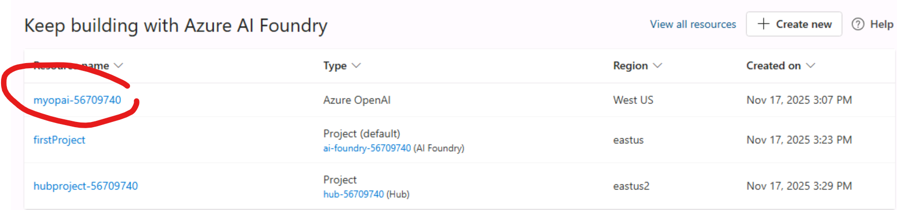
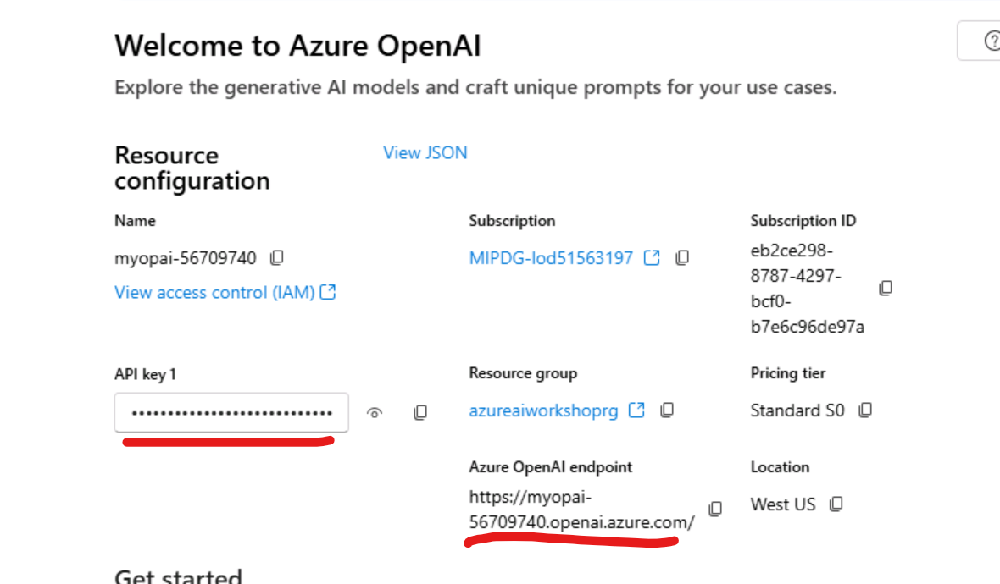

# Azure PostgreSQL Lab
 
## Introduction
In this lab you will learn how perform vector search on PostgreSQL.
 
## Objectives
Store and retrieve vector data.
Perform similarity searches using PostgreSQL.
 
## Estimated Time
20 minutes
 
## Scenario
You want to use PostgreSQL for your AI application's backend and need to store and search vectors efficiently. This lab will walk you through the necessary steps.
 
## Pre-requisites
None. The Azure PostgreSQL server has been pre-created for you.
 
## Tasks
## Part 1 – Enable Vector Search Extensions in PostgreSQL

1. **Navigate to Server Parameters in Azure Portal**
   - Go to your Azure PostgreSQL server in the Azure Portal.
   - In the left menu, select **Server parameters**.

2. **Enable Required Extensions**
   - Search for `azure.extensions`.
   - Select **AZURE_AI** and **VECTOR**.
   - Click **Save** at the top.


**Result:** The PostgreSQL server is now configured to use Azure AI functions and the `vector` data type for similarity search.

---

## Part 2 – Create and Restore the `books` Database

### Step 1: Set PostgreSQL Password in PowerShell
Right-click the Start Menu and choose Terminal(Admin) to open up a new PowerShell terminal:


If the terminal is not current set to using PowerShell, then type in "powershell" so that you are in a PS prompt.  

Enter the command below to set the PGPassword for the user that we will be using to connect to the PostgreSQL database:

```powershell
$env:PGPASSWORD = "Password12345!!"
```


This sets your PostgreSQL password for the current session. Be sure to keep this terminal open for the duration of the lab.

---

### Step 2: Connect with `psql` and Create Database
Navigate to the Azure Database for PostgreSQL Flexible Server resource in the Azure Portal.  Copy the server endpoint - we will use this to connect to the PostgreSQL instance.  


In the same PowerShell Admin window, run the following command to connect to the PostgreSQL server instance.  Be sure to replace the -h parameter below with the PostgreSQL endpoint you copied in the above step.

```powershell
psql -h pgaivector-<server-id>.postgres.database.azure.com -U postgres -d postgres
```
Inside `psql`, create the database:
```sql
create database books;
\q
```


---

### Step 3: Restore Database from Backup
This step will restore a PostgreSQL database from a backup file on-disk. 

In the open PowerShell terminal, execute the following command.  Remember to swap the server name out so you are connecting to the server endpoint copied earlier.

```powershell
pg_restore -h pgaivector-<server-id>.postgres.database.azure.com -U postgres -d books "C:\Users\Admin\Desktop\LABS\Lab 10 - Vector-DB\PostgreSQL\books\books"
```
> Ignore any harmless errors/warnings about pre-existing objects or transaction_timeout.


---

## Part 3 – Connect with pgAdmin and Load the Query Script

1. **Register Server in pgAdmin**
   - Open pgAdmin.
   - Right-click **Servers → Register → Server**.
   - Under **General**, name it `AIWorkshop`.


2. **Enter Connection Details**
   - Host: `pgaivector-<server-id>.postgres.database.azure.com`
   - Port: `5432`
   - Maintenance DB: `postgres`
   - Username: `postgres`
   - Password: `Password12345!!`
   - Save.


3. **Open `books` Database**
   - Expand **Databases** → `books`.
   - Open the query editor.
   - Execute the following query to return the top 20 records from the books table.  Be sure to explore the data, especially the desc_embedding column. This column represents the data from the description field, but in vectorized form. 

```sql
select *
from books
limit 20;
```

4. **Open the VectoryQuery.sql Script**
   - Open a new Query Tool window to establish a new connection to PostgresSQL.  
   - Press `Ctrl+O` and open the `VectorQuery.sql` file located at C:\Users\Admin\Desktop\LABS\Lab 10 - Vector-DB\PostgreSQL\VectoryQuery.sql


At the top of the script we will need to set our Azure OpenAI endpoint and API key.  

For this, use the OpenAI Deployment that was deployed as part of this lab.





---

## Part 4 – Deploy the Embedding Model in Azure OpenAI
We will need to deploy an embedding model in our Azure OpenAI resource in order to perform vector-based searches on our PostgreSQL data.  

1. **Go to Azure OpenAI in the Azure Portal**
   - Open your Azure OpenAI resource.
   - Click **Explore Azure AI Foundry portal**.


2. **Select the Model**
   - Go to **Model catalog**.
   - Search for `embedding`.
   - Click **text-embedding-ada-002**.


3. **Deploy the Model**
   - Click **Use this model**.
   - Enter:
     - Deployment Name: `text-embedding-ada-002`
     - Deployment Type: `Global Standard`
   - Click **Deploy**.


4. **Copy Endpoint and Keys**
   - Go to the Azure OpenAI Resource in the Azure Portal
   - Click on either the Endpoints or Manage Keys link (both go to the same place)
   - Copy the Endpoint and one of the keys.  We will need these values for setting up the azure_ai extension in PostgreSQL.


---

## Part 5 – Run Vector Similarity Search in PostgreSQL

With the model deployed and `VectorQuery.sql` loaded in pgAdmin, swap out the copied values from the last step for the azure_openai.endpoint and azure_openai.subscription_key values in the script.

1. **Replace placeholders**:
   - `<your-endpoint>` → Your Azure OpenAI endpoint from the Keys & Endpoint page.
   - `<your-api-key>` → Your Azure OpenAI subscription key.

   ```sql
   select azure_ai.set_setting('azure_openai.endpoint', 'https://<your-endpoint>.openai.azure.com/');
   select azure_ai.set_setting('azure_openai.subscription_key', '<your-api-key>');
   ```
1. **Execute Query**:

Now that everything is set up, you can perform a consine similarity search.  In the query below, the text-embedding-ada-002 model (we deployed this eariler) is used to generate a vector embedding of the text value "trigonometry".  This embedding is then compared to the desc_embedding column from the table to find those book reviews where the description is similar to the word "trigonometry".

   ```sql
   WITH params AS (
     SELECT azure_openai.create_embeddings('text-embedding-ada-002', 'trigonometry')::vector(1536) AS qvec
   )
   SELECT
     b.book_id,
     b.title,
     b.desc_embedding <-> params.qvec AS distance
   FROM books AS b
   CROSS JOIN params
   ORDER BY distance
   LIMIT 5;
   ```


3. **Execute the Query**
   - The results will list the top 5 books most similar in meaning to the search term `"trigonometry"`.


**Result:** You have successfully run a vector similarity search in PostgreSQL using an Azure OpenAI embedding model.

